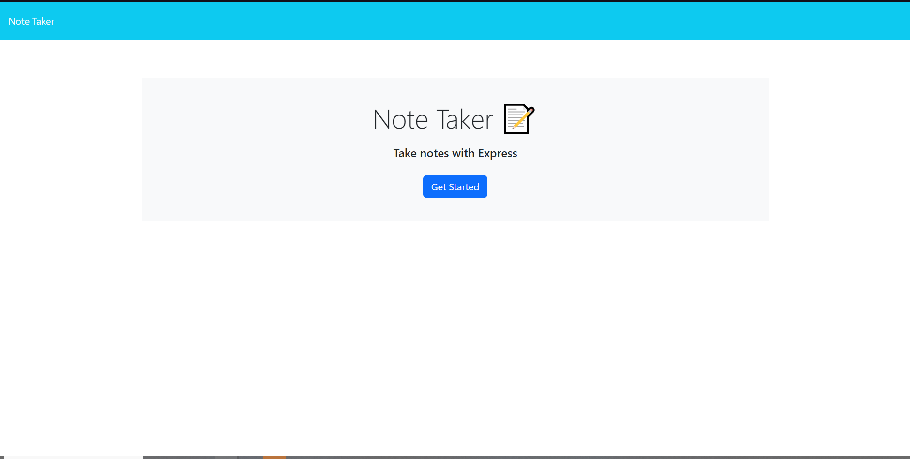
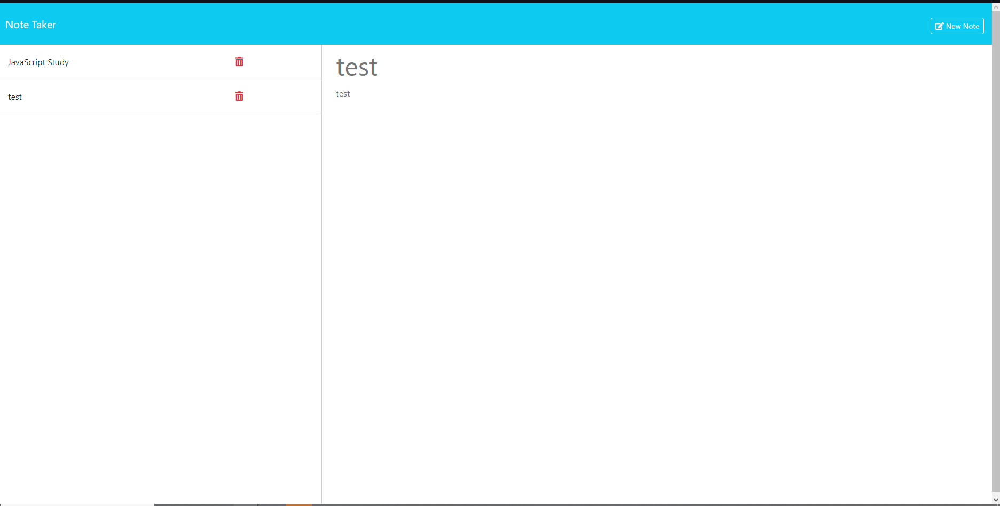

# Note-Taker

## Description
This is a full-stack express application that allows users to create and delete notes.

## Preview of The Program

[Note-Taker Website](https://note-taker-nb5v.onrender.com)

## Table of Contents
- [Installation](#installation)
- [Usage](#usage)
- [License](#license)
- [Contributing](#contributing)
- [Tests](#tests)
- [Questions](#questions)

## Installation
* First download this repo
* Second check server.js and make sure the API routes are set correctly 
* Third NPM I
* Fourth npm install express fs
* the Fifth npm install uuid
* Last you should be able to do node server.js and the application should launch

## Usage
The purpose of this full-stack application is so that users have a place to organize plans via the usage of making notes and or deleting them.

## Contributing
I used BlackBox, starter code, and Slack Assistant. 

## Tests
Was able to create notes numerous times. The project results are shown in the video.

## Questions
If you have any questions, you can reach me at [GitHub: Unevailable](https://github.com/Unevailable) or contact me via email at al.amin003@hotmail.com.

## License
This project is licensed under the [MIT License license]([License Link](https://opensource.org/licenses/mit)).
